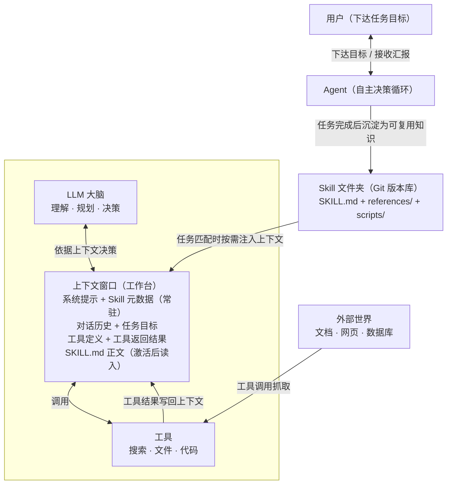

# 三个概念的关系：Agent、大模型的上下文、Skill

> **一句话版本：Agent 是干活的司机，上下文是挡风玻璃里能看见的一切，Skill 是随车携带的操作手册。**

对应的可视化版本见 [concept-relationship.html](concept-relationship.html)（含 SVG 关系图），本页是纯文字 + Mermaid 版。

## 1. 总体关系

```
Agent  = LLM 大脑 + 工具 + 决策循环
上下文 = Agent 的工作台（它每一步决策能"看见"的全部信息）
Skill  = 沉淀在文件里、按需搬上工作台的任务知识
```

三个概念**不在同一层面**：

- **Agent 是系统** —— 回答"谁来完成任务、怎么完成"
- **上下文是资源/约束** —— 回答"模型此刻能看见什么"
- **Skill 是知识资产** —— 回答"这类任务的标准做法是什么"

## 2. 概念对照表

| 维度 | Agent | 大模型的上下文 | Skill |
|---|---|---|---|
| 本质 | 一个能自主决策执行任务的系统 | 模型推理时可见的信息总量（工作记忆） | 一个含 SKILL.md 的文件夹（任务知识包） |
| 回答的问题 | 谁来干活？怎么干？ | 模型此刻能看见什么？ | 这类任务的标准做法是什么？ |
| 生命周期 | 随任务启动与结束 | 随每轮请求重建、逐轮累积 | 长期存在，可版本化迭代 |
| 类比 | 司机 | 挡风玻璃 + 仪表盘所见 | 随取随用的操作手册 |
| 失效方式 | 任务失败 / 无限循环 / 超预算 | 窗口占满、信息被挤出、被无关内容干扰 | 描述不清导致从不被激活；内容过时 |
| 互相依赖 | 依赖上下文做决策，依赖 Skill 获得方法 | 被 Agent 消耗，被 Skill 按需填充 | 通过上下文作用于 Agent 的行为 |

## 3. 关系图（Mermaid）



## 4. 上下文如何影响 Agent 的工作

上下文对 Agent 的影响**贯穿每一步决策**，具体有四点：

1. **决定"看得见什么"**：Agent 每一步只依据当前上下文做决策。工具结果没进上下文，等于没发生；早期对话被挤出窗口，Agent 就会"失忆"式地重复劳动。
2. **决定"任务能不能延续"**：多轮任务的全部中间结果都靠上下文承载。窗口占满、压缩不当，任务线索就会断裂——这是长任务失败的头号原因之一。
3. **决定"注意力质量"**：上下文不是越多越好。无关的旧结果会稀释模型注意力，干扰当前决策。上下文工程（该进来的精选进来、该清理的清出去）直接决定 Agent 的输出质量。
4. **决定"成本与延迟"**：Agent 每一轮都把累积的上下文重新发给模型，token 消耗随轮次线性增长——上下文管理不佳的 Agent，成本可能比必要的多一个数量级。

> **一句话：Agent 的能力上限由模型决定，但实际表现由上下文管理决定。**

## 5. Skill 如何沉淀可复用的任务知识

Skill 解决的是 Agent 的"经验不能积累"问题——对话结束，这次任务里摸索出的好方法就丢了。沉淀机制有四点：

1. **把方法写成文件**：任务的标准流程、输出结构、检查清单写进 SKILL.md，从"口头交代"变成"文档资产"。
2. **按需注入而非常驻**：渐进式披露让成百上千个 Skill 只以极小的元数据成本常驻，任务匹配时才展开正文——用最小的上下文代价，携带最多的任务知识。
3. **可版本化、可分享**：Skill 就是普通文件夹，放进 Git 仓库即可版本管理、迭代改进、分享给团队（项目级 `.workbuddy/skills/`）或跨项目复用（用户级）。
4. **形成知识闭环**：任务中验证有效的方法沉淀进 Skill → 下次同类任务自动激活 → 使用中发现不足再迭代 Skill。个人/团队的经验由此持续累积，而不是散落在无数对话里。

> **一句话：上下文是易失的"工作台"，Skill 是持久的"工具箱"；Agent 每次任务把工具箱里适用的手册搬上工作台，干完活再把更好的手册放回去。**

## 6. 用本次作业验证三者关系

- 我面对的 **Agent**（WorkBuddy）接收到作业目标后自主拆解步骤：查环境 → 建仓库 → 写 Skill → 查资料 → 生成页面 → 提交推送——没有预写死的流程，这是 Agent。
- 它每一步"看得见"的东西——作业要求、仓库状态、搜索到的资料——全在**上下文**里；只保留核实过的少数搜索结果而不是堆入几十条，这是上下文管理。
- 作业要求我们把"学概念"的方法写成 `.workbuddy/skills/learning-material-generator/SKILL.md`，之后任何新概念都能复用这套流程——学习经验从一次性对话**沉淀**成了版本库里的知识资产，这是 Skill。

> 三个概念在这次作业中刚好构成一个完整闭环：**Agent 借助良好的上下文管理完成了任务，并把任务方法沉淀为 Skill，供未来的 Agent 任务复用。**
